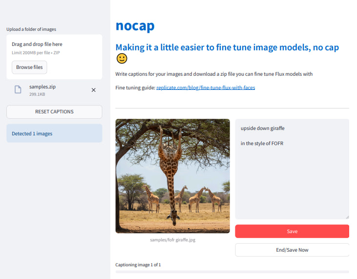

# nocap

Easily create captioned datasets to fine tune flux or other models



---

`app.py` - the main app, basically the only thing here lol

---

Run with:
```bash
pip install -r requirements.txt # the only dependency is streamlit
streamlit run app.py
```

---

**Using Codespaces/VSCode**

Everything you need will be installed when you open Codespaces/VSCode; specified in .devcontainer/

*Notes for Codespaces:*
- [aider](https://aider.chat) is automatically installed with pipx
    - It's optional, you don't have to use it
    - Needs an OpenAI API key to work, saved as `OPENAI_API_KEY`